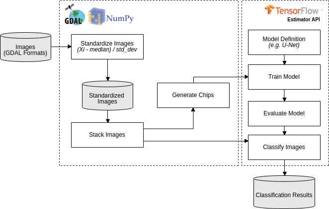

Application with Deep Learning
==============================

Machine Configuration
---------------------

    Deep learning is a field with intense computational requirements mainly when you deal with image processing.

    For this project we proposed a structure to integrate GEE (Google Earth Engine) and Tensorflow.

1. Minimal Requirements

    | Google Cloud Account
    | Create an computer engine instance:
    |   1 core
    |   3.5gb RAM
    |   60gb of Storage (hdd or ssd)
    |   Ubuntu 16.04
    |   1 GPU Nvidia K80

2. Installation of the libraries

    This material is based on `Using a GPU & TensorFlow on Google Cloud Platform <https://medium.com/google-cloud/using-a-gpu-tensorflow-on-google-cloud-platform-1a2458f42b0>`_

    - Install python and jupyter

    .. code-block:: bash

        # system update
        apt-get -y update

        # python pip installation
        apt install -y python-pip

        # config to notebook
        apt-get -y install ipython

        apt-get -y install ipython-notebook

        # jupyter installation
        pip install jupyter

        apt-get -y install python3-pip

        python3 -m pip install ipykernel

        # python kernel to jupyter notebook
        python3 -m ipykernel install --user

        # only python 3
        cd /notebooks && jupyter notebook --allow-root --ip='*'

3. Driver installation

    In this point it is required to install `nvidia driver <https://www.nvidia.com.br/Download/driverResults.aspx/135486/br>`_ and `gpu driver <http://developer.download.nvidia.com/compute/cuda/repos/ubuntu1604/x86_64/>`_.

    To install the gpu driver it can be used this code

    .. code-block:: bash

        #!/bin/bash
        echo "Checking for CUDA and installing."
        # Check for CUDA and try to install.
        if ! dpkg-query -W cuda; then
            # The 16.04 installer works with 16.10.
            curl -O http://developer.download.nvidia.com/compute/cuda/repos/ubuntu1604/x86_64/cuda-repo-ubuntu1604_9.0.176-1_amd64.deb
            dpkg -i ./cuda-repo-ubuntu1604_9.0.176-1_amd64.deb
            apt-get update
            # apt-get install cuda -y
            sudo apt-get install cuda-9-0
        fi

4. Installing cuDNN

    In this point it is needed to be logged in nvidia website and download `cudnn-download <https://developer.nvidia.com/rdp/cudnn-download>`_ and send to the server by scp copy file.

    To install:

    .. code-block:: bash

        cd $HOME
        tar xzvf cudnn-9.0-linux-x64-v5.1.tgz
        sudo cp cuda/lib64/* /usr/local/cuda/lib64/
        sudo cp cuda/include/cudnn.h /usr/local/cuda/include/
        rm -rf ~/cuda
        rm cudnn-9.0-linux-x64-v5.1.tgz

5. Test

    Install library on system

    .. code-block:: bash

        # must use tensorflow 1.9
        pip install --upgrade tensorflow-gpu==1.9.0

        nvidia-smi -l

    Run code

    .. code-block:: python

        # tensorflow library
        import tensorflow as tf
        sess = tf.Session(config=tf.ConfigProto(log_device_placement=True))

dl-semantic-segmentation
------------------------

The project of this tutorial can be found in this `link <https://github.com/NexGenMap/dl-semantic-segmentation>`_.

Deep-learning applied to semantic segmentation of remote sensing data, according to this workflow: 

Workflow Execution (Forest toy data)
------------------------------------

Download the Forest toy data in `this link <https://storage.googleapis.com/nextgenmap-dataset/dl-semantic-segmentation/forest_toy.zip>`_ and follow the instructions below:

1. Standardize the two images, the one will be used to train the model e another one that will be classified:

.. code-block:: bash

    ./standardize_imgs.py -n 0 -b 1 2 3 4 -i forest_toy/raw_data/mosaic_201709.tif forest_toy/raw_data/mosaic_201801.tif -o forest_toy/stand_data

2. Stack the standardized image and the forest map (e.i. the reference data):

.. code-block:: bash

    ./stack_imgs.py -i forest_toy/stand_data/mosaic_201709_stand.tif -r forest_toy/raw_data/forest_201709.tif -o forest_toy/stand_data/forest_201709_model_input.vrt

3. Generate the chips (i.e. a set of pixels with regular squared size) without data augmentation (see Usages_):

.. code-block:: bash

    ./generate_chips.py forest_toy/stand_data/forest_201709_model_input.vrt -o forest_toy/chips

4. Train a U-net model, for 20 epochs, using default hyperparameter (see Usages_):

.. code-block:: bash

    ./train_model.py -e 20 -i forest_toy/chips -o forest_toy/model/

- Follow the trainning process using tensorboard:

.. code-block:: bash

    tensorboard --logdir=forest_toy/model/

5. Evaluate the trained model:

.. code-block:: bash

    ./evaluate_model.py -m forest_toy/model

6. Classify the other image:

.. code-block:: bash

    ./classify_imgs.py -m forest_toy/model -i forest_toy/raw_data/mosaic_201801.tif -o forest_toy/result

- Check the classification result, forest_toy/result/mosaic_201801_pred.tif, in QGIS:

.. code-block:: bash

    ./classify_imgs.py -m forest_toy/model -i forest_toy/raw_data/mosaic_201801.tif -o forest_toy/result

Usages
------

**standardize_imgs.py**

.. code-block:: bash
    
    usage: standardize_imgs.py [-h] -i IMAGES [IMAGES ...] -b BANDS [BANDS ...] -n
                           IN_NODATA [-d OUT_NODATA] [-t CONVERT_INT16] -o
                           OUTPUT_DIR [-c CHUNK_SIZE]

    STEP 01/06 - Standardize multiple images using the formula: (value - median) /
    std_dev. The median and std_dev will be calculate by band (e.g. blue, red)
    considering all images.

    optional arguments:
        -h, --help            show this help message and exit
        -i IMAGES [IMAGES ...], --images IMAGES [IMAGES ...]
                                <Required> List of input images.
        -b BANDS [BANDS ...], --bands BANDS [BANDS ...]
                                <Required> The image bands that will be standardized.
        -n IN_NODATA, --in-nodata IN_NODATA
                                <Required> Nodata value of input images.
        -d OUT_NODATA, --out-nodata OUT_NODATA
                                Nodata value of standardized images. It will be
                                ignores when convert-int16=True. [DEFAULT=-50]
        -t CONVERT_INT16, --convert-int16 CONVERT_INT16
                                Convert the standardized images to int16, multiply its
                                pixel values by scale factor 10000. It will reduce the
                                size of the output files and use -32767 as nodata
                                value. [DEFAULT=False]
        -o OUTPUT_DIR, --output-dir OUTPUT_DIR
                                <Required> Output directory that will have the
                                standardized images.
        -c CHUNK_SIZE, --chunk-size CHUNK_SIZE
                                The amount of data that will be processed, per time,
                                by standardization process. In case of memory error
                                you should decrease this argument. [DEFAULT=1000]

**stack_imgs.py**

.. code-block:: bash

    usage: stack_imgs.py [-h] -i IMAGES [IMAGES ...] [-b BANDS [BANDS ...]]
                     [-r REFERENCE] -o OUTPUT

    STEP 02/06 - Stack multiple images into a sigle Virtual Dataset-VRT image. If
    informed, the reference image will the last band.

    optional arguments:
        -h, --help            show this help message and exit
        -i IMAGES [IMAGES ...], --images IMAGES [IMAGES ...]
                                <Required> List of input images.
        -b BANDS [BANDS ...], --bands BANDS [BANDS ...]
                                The bands that should be stacked. [DEFAULT=All]
        -r REFERENCE, --reference REFERENCE
                                <Required> Image with reference data, that should have
                                only these pixel values: 0=without information,
                                1=object of interest, 2=not an object of interest.
        -o OUTPUT, --output OUTPUT
                                <Required> The name of VRT output image

**generate_chips.py**

.. code-block:: bash

    usage: generate_chips.py [-h] -i IMAGE -o OUTPUT_DIR [-n NODATA]
                         [-s CHIP_SIZE] [-p PAD_SIZE] [-f OFFSET [OFFSET ...]]
                         [-r ROTATE] [-l FLIP] [-d DISCARD_NODATA]

    STEP 03/06 - Generate a several chips (i.e. a set of pixels with regular
    squared size) considerering the input image. The last band will be used as
    expected output result, and should have only these pixel values: 0=without
    information, 1=object of interest, 2=not an object of interest. If a chip has
    only pixel values equal to 0, into reference band, the chip will discarded.

    optional arguments:
        -h, --help            show this help message and exit
        -i IMAGE, --image IMAGE
                                <Required> Input image that will be used by chip
                                generation process.
        -o OUTPUT_DIR, --output-dir OUTPUT_DIR
                                <Required> The output directory that will have the
                                generated chips.
        -n NODATA, --nodata NODATA
                                Nodata value of input image. [DEFAULT=-50]
        -s CHIP_SIZE, --chip-size CHIP_SIZE
                                Size of the chip with output result. A chip always
                                will be a square. [DEFAULT=100]
        -p PAD_SIZE, --pad-size PAD_SIZE
                                Padding size that will establish the size of input
                                chip, with spectral data. A padding size of 93px and a
                                chip size of 100px will result in a input chip of
                                286px. [DEFAULT=93]
        -f OFFSET [OFFSET ...], --offset OFFSET [OFFSET ...]
                                As a data augmentation option, offset argument will be
                                used to produce chips with a percentage of overlap. An
                                offset 0,50 will generate chips with 50 percent of
                                overlap in the axis y. [DEFAULT=0,0]
        -r ROTATE, --rotate ROTATE
                                As a data augmentation option, rotate argument will
                                rotate all the chips at angles 90, 180 and 270
                                degrees. [DEFAULT=True]
        -l FLIP, --flip FLIP  As a data augmentation option, flip argument will
                                flip, in the left/right direction, all the chips.
                                [DEFAULT=True]
        -d DISCARD_NODATA, --discard-nodata DISCARD_NODATA
                                Chips with nodata values will be discard by chip
                                generation process. You shouldn not considerer put true
                                here. [DEFAULT=True]

**evaluate_model.py**

.. code-block:: bash

    usage: evaluate_model.py [-h] -m MODEL_DIR

    STEP 05/06 - Evaluate a trained model.

    optional arguments:
        -h, --help            show this help message and exit
        -m MODEL_DIR, --model-dir MODEL_DIR
                                <Required> Input directory with the trained model and
                                the tensorboard logs.

**classify_imgs.py**

.. code-block:: bash

    usage: classify_imgs.py [-h] -i IMAGES [IMAGES ...] -m MODEL_DIR -o OUTPUT_DIR
                        [-p MEMORY_PERCENTAGE]

    STEP 06/06 - Classify a list of images using a trained model.

    optional arguments:
        -h, --help            show this help message and exit
        -i IMAGES [IMAGES ...], --images IMAGES [IMAGES ...]
                                <Required> List of input images that will be
                                classified.
        -m MODEL_DIR, --model-dir MODEL_DIR
                                <Required> Input directory with the trained model and
                                the tensorboard logs.
        -o OUTPUT_DIR, --output-dir OUTPUT_DIR
                                <Required> The output directory that will that will
                                have the classification output.
        -p MEMORY_PERCENTAGE, --memory-percentage MEMORY_PERCENTAGE
                                Reading the input image until memory percentage reach
                                the value defined by this argument. After that, the
                                classification will execute for readed data.
                                [DEFAULT=40.0]